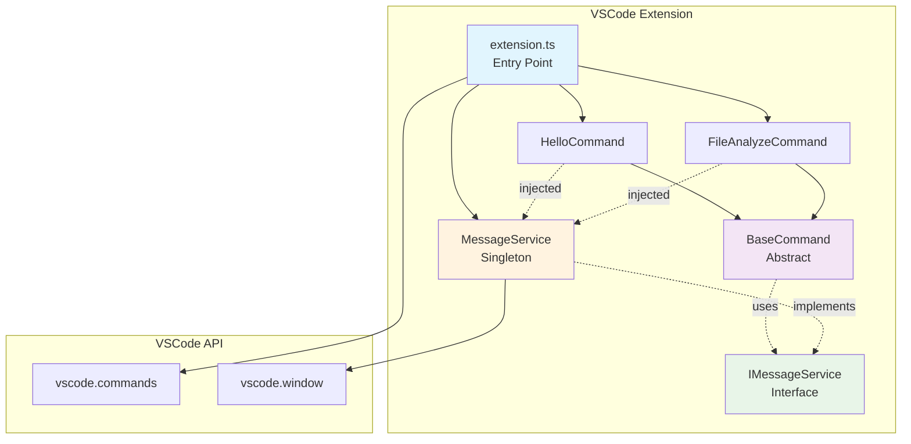
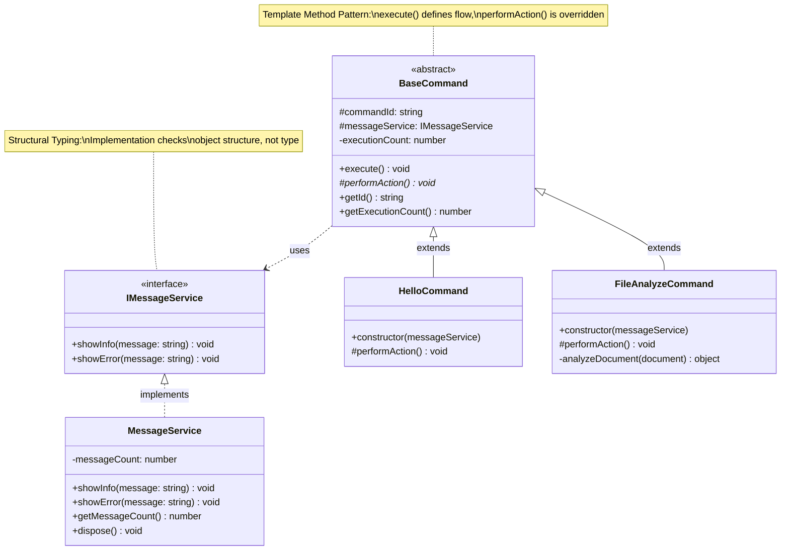
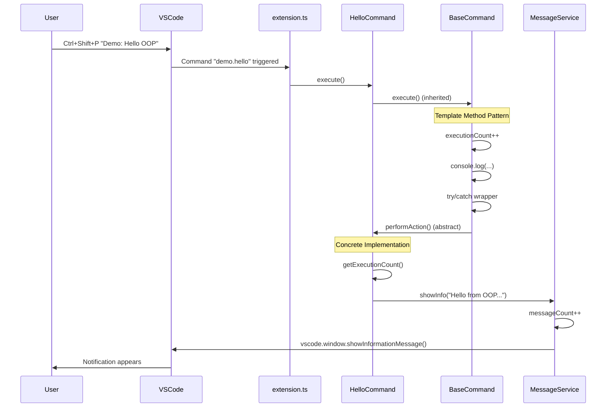
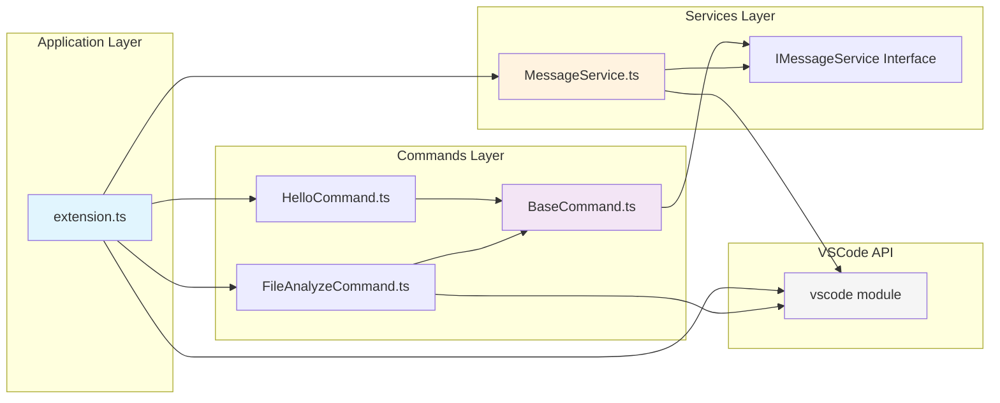

# OOP Fundamentals for VSCode Extensions

## 🎯 Learning Objectives

This extension demonstrates **4 central OOP concepts** for VSCode Extensions:

1. **Interface-based Services** (structural typing)
2. **Abstract Base Classes** (Template Method Pattern)  
3. **Dependency Injection** (manual, simple)
4. **Dispose Pattern** (resource management)

## 📊 Architecture Overview



## 📁 Simple Structure

```
src/
├── extension.ts                    # Entry Point with DI
├── services/
│   └── MessageService.ts          # Interface + Implementation
└── commands/
    ├── BaseCommand.ts              # Abstract Base Class
    ├── HelloCommand.ts             # Simple Command
    └── FileAnalyzeCommand.ts       # Command with Business Logic
```

## 🏗️ Class Diagram



## 🔄 Sequence Diagram: Command Execution



## 🔗 Module Dependencies



## 🔧 Setup

```bash
# Create folders
mkdir -p src/services src/commands

# Copy code from Artifact
# Files: MessageService.ts, BaseCommand.ts, HelloCommand.ts, FileAnalyzeCommand.ts, extension.ts

# Compile and start
yarn compile && F5
```

## 🎮 Testing Commands

- `Demo: Hello OOP` - Simple command with service
- `Demo: Analyze File` - Editor analysis  
- `Demo: Show Status` - Execution statistics

## 🔍 OOP Concepts in Detail

### 1. Interface-based Services

```typescript
// Interface defines contract
interface IMessageService {
    showInfo(message: string): void;
    showError(message: string): void;
}

// Class implements interface (structurally!)
class MessageService implements IMessageService {
    // Implementation...
}
```

**Java Difference:** TypeScript checks structurally, not nominally.

### 2. Abstract Base Class (Template Method)

```typescript
abstract class BaseCommand {
    public execute(): void {
        // Template Method defines flow
        this.performAction(); // Abstract method
    }
    
    protected abstract performAction(): void;
}
```

**Known from Java:** Same syntax, same semantics.

### 3. Dependency Injection (manual)

```typescript
// Service is injected in constructor
class HelloCommand extends BaseCommand {
    constructor(messageService: IMessageService) {
        super('demo.hello', messageService);
    }
}

// In extension.ts: Manually create and inject services
const messageService = new MessageService();
const command = new HelloCommand(messageService);
```

**Simplified:** No framework like Spring, but same principle.

### 4. Dispose Pattern

```typescript
class MessageService {
    public dispose(): void {
        // Cleanup logic
    }
}

// In extension.ts: Automatic cleanup
context.subscriptions.push({
    dispose: () => messageService.dispose()
});
```

**VSCode-specific:** Automatic cleanup when deactivating.

## 📊 Comparison: Functional vs. OOP

| Aspect | Functional | OOP |
|--------|------------|-----|
| Commands | Individual functions | Class hierarchy |
| Shared Logic | Code duplication | BaseCommand inheritance |  
| Services | Direct API calls | Injected dependencies |
| Testing | Hard to mock | Interface mocking |
