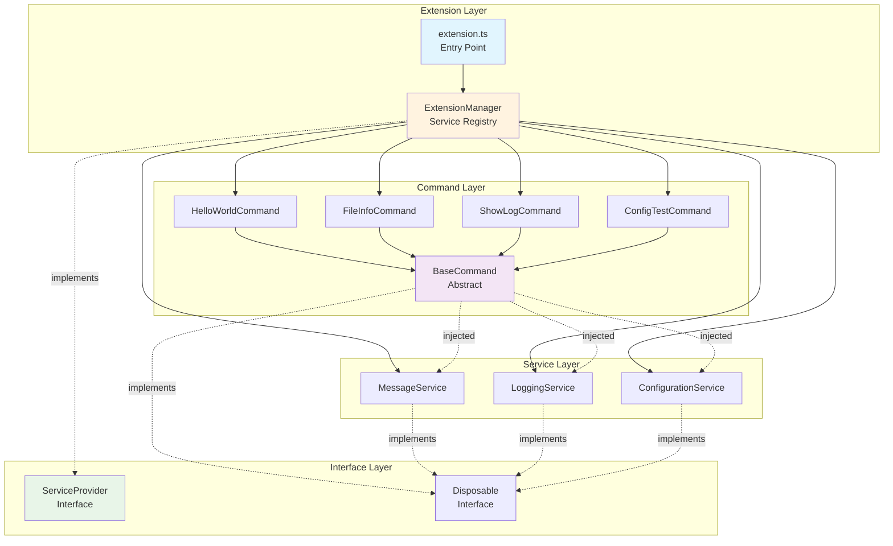
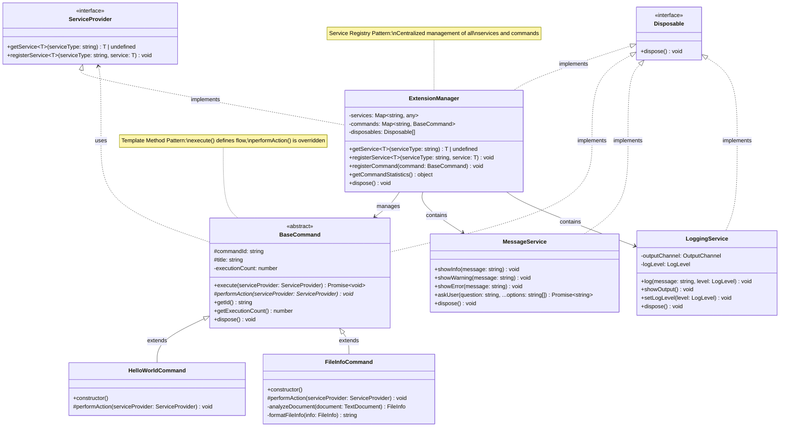
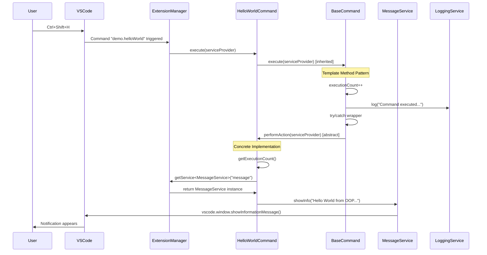

# OOP Fundamentals for VSCode Extensions

## 🎯 Learning Objectives

This extension demonstrates **object-oriented architecture** for VSCode Extensions with TypeScript and shows the implementation of proven design patterns:

1. **Service-oriented Architecture** with Dependency Injection
2. **Template Method Pattern** for unified command execution
3. **Service Registry Pattern** for centralized service management
4. **Dispose Pattern** for automatic resource management

---

## 📊 Architecture Overview



---

## 📁 Project Structure

```
src/
├── extension.ts                    # Extension Entry Point
├── ExtensionManager.ts             # Service Registry & DI Container
├── interfaces/
│   ├── ServiceProvider.ts          # DI Interface
│   └── Disposable.ts               # Resource Management Interface
├── services/
│   ├── MessageService.ts           # User Interaction Service
│   ├── LoggingService.ts           # Logging with Output Channel
│   └── ConfigurationService.ts     # Typed Configuration
└── commands/
    ├── BaseCommand.ts              # Template Method Pattern
    ├── HelloWorldCommand.ts        # Simple Demo Command
    ├── FileInfoCommand.ts          # Document Analysis Command
    ├── ShowLogCommand.ts           # Log Display Command
    └── ConfigTestCommand.ts        # Configuration Demo Command
```

---

## 🎮 Commands & Shortcuts

| Command | Shortcut | Description |
|---------|----------|-------------|
| **Demo: Hello World** | `Ctrl+Shift+H` | Simple command with service injection |
| **Demo: Show File Information** | `Ctrl+Shift+I` | Analyzes active file (editor required) |
| **Demo: Show Extension Log** | `Ctrl+Shift+L` | Opens extension log in output panel |
| **Demo: Test Configuration** | `Ctrl+Shift+C` | Interactive configuration change |

> **macOS:** Use `Cmd` instead of `Ctrl`

**Alternative Usage:**
- Command Palette: `Ctrl+Shift+P` → "Demo: ..."
- All commands are also available via Command Palette

---

## 🏗️ Class Diagram



---

## 🔄 Sequence Diagram: Command Execution



---

## 🔧 Setup & Installation

### Prerequisites
- **Node.js** (16+) and **Yarn**
- **VSCode** with Extension Development Support
- **TypeScript** basic knowledge

### Installation
```bash
# 1. Initialize project
mkdir vscode-oop-demo && cd vscode-oop-demo
yarn init -y

# 2. Install dependencies
yarn add -D @types/vscode @types/node @types/mocha
yarn add -D typescript @typescript-eslint/eslint-plugin @typescript-eslint/parser
yarn add -D eslint @vscode/test-cli @vscode/test-electron

# 3. Create project structure
mkdir -p src/{interfaces,services,commands}
mkdir -p .vscode

# 4. Create code files (see Artifacts)
# - package.json (complete configuration)
# - tsconfig.json 
# - extension.ts + all other TypeScript files

# 5. Compile and test
yarn compile
```

### Development Workflow
```bash
# Watch mode for automatic compilation
yarn watch

# Test extension (opens new VSCode window)
F5 (in VSCode)

# Or manually:
code --extensionDevelopmentPath=.
```

---

## 🔍 OOP Concepts in Detail

### 1. Service Registry Pattern (Dependency Injection)

```typescript
// ExtensionManager as DI Container
export class ExtensionManager implements ServiceProvider {
    private services: Map<string, any> = new Map();
    
    // Register service
    public registerService<T>(serviceType: string, service: T): void {
        this.services.set(serviceType, service);
    }
    
    // Get service (Dependency Injection)
    public getService<T>(serviceType: string): T | undefined {
        return this.services.get(serviceType);
    }
}

// Usage in commands
const messageService = serviceProvider.getService<MessageService>('message');
messageService?.showInfo('Hello World!');
```

**Benefits:**
- Decoupling of services and consumers
- Testability through service mocking
- Centralized service management

### 2. Template Method Pattern

```typescript
// BaseCommand defines unified flow
export abstract class BaseCommand {
    public async execute(serviceProvider: ServiceProvider): Promise<void> {
        this.executionCount++;                    // 1. Increment counter
        this.logExecution(serviceProvider);      // 2. Logging
        
        try {
            await this.performAction(serviceProvider); // 3. Concrete action
        } catch (error) {
            this.handleError(error, serviceProvider);   // 4. Error handling
        }
    }
    
    // Abstract method - implemented by subclasses
    protected abstract performAction(serviceProvider: ServiceProvider): Promise<void> | void;
}
```

**Benefits:**
- Unified command lifecycle
- Automatic error handling and logging
- Code reuse

### 3. Interface-based Services

```typescript
// Interface defines contract
export interface ServiceProvider {
    getService<T>(serviceType: string): T | undefined;
    registerService<T>(serviceType: string, service: T): void;
}

// Structural typing (TypeScript-specific)
export interface Disposable extends vscode.Disposable {
    dispose(): void;
}
```

**TypeScript vs. Java:**
- Structural instead of nominal typing
- Duck typing: "If it walks like a duck..."
- Interfaces can be extended

### 4. Dispose Pattern for Resource Management

```typescript
export class LoggingService implements Disposable {
    private outputChannel: vscode.OutputChannel;
    
    constructor(channelName: string) {
        this.outputChannel = vscode.window.createOutputChannel(channelName);
    }
    
    public dispose(): void {
        this.outputChannel.dispose(); // Release VSCode resource
    }
}

// Automatic registration for cleanup
context.subscriptions.push(service);
```

**VSCode-specific:**
- Automatic cleanup when extension deactivates
- Prevention of memory leaks
- Proper resource disposal

---

## ⚙️ Configuration

The extension supports the following settings (via `Ctrl+,` → Extensions → Demo Extension):

| Setting | Type | Default | Description |
|---------|------|---------|-------------|
| `demo.logLevel` | enum | `"info"` | Log level: debug, info, warn, error |
| `demo.autoSave` | boolean | `true` | Enable automatic saving |
| `demo.maxFileSize` | number | `1024` | Max file size in KB for processing |
| `demo.enableDebugOutput` | boolean | `false` | Enable debug output in console |

**Runtime configuration changes:**
- `Ctrl+Shift+C` → Interactive configuration
- Settings are applied immediately
- Log level is automatically adjusted

---

## 🧪 Testing & Debugging

### Debug Mode
```bash
# 1. Start watch mode
yarn watch

# 2. Start debug extension
F5 (in VSCode)

# 3. Set breakpoints
# - In commands: performAction() methods
# - In services: All public methods
# - In ExtensionManager: Service registration
```

### Logging
- **Output Panel:** `Ctrl+Shift+L` → "Demo Extension"
- **Debug Console:** `F12` → Console (in debug extension)
- **Log Level:** Via `demo.logLevel` setting or `Ctrl+Shift+C`

### Tests
```bash
# Run unit tests (if implemented)
yarn test

# Extension tests
yarn pretest
```

---

## 🚀 Extension Possibilities

### Adding a New Command

1. **Create command class:**
```typescript
// src/commands/MyNewCommand.ts
export class MyNewCommand extends BaseCommand {
    constructor() {
        super('demo.myNew', 'My New Command');
    }
    
    protected performAction(serviceProvider: ServiceProvider): void {
        const messageService = serviceProvider.getService<MessageService>('message');
        messageService?.showInfo('My new command executed!');
    }
}
```

2. **Register in package.json:**
```json
{
  "command": "demo.myNew",
  "title": "My New Command",
  "category": "Demo"
}
```

3. **Add to extension.ts:**
```typescript
const commands: BaseCommand[] = [
    // ... existing commands
    new MyNewCommand()
];
```

### Adding a New Service

1. **Create service class:**
```typescript
// src/services/FileService.ts
export class FileService implements Disposable {
    public readFile(path: string): string {
        // Implementation
    }
    
    public dispose(): void {
        // Cleanup
    }
}
```

2. **Register in ExtensionManager:**
```typescript
this.registerService('file', new FileService());
```

3. **Use in commands:**
```typescript
const fileService = serviceProvider.getService<FileService>('file');
```

---

## 📚 Further Resources

### VSCode Extension API
- [Extension API Documentation](https://code.visualstudio.com/api)
- [Extension Guidelines](https://code.visualstudio.com/api/ux-guidelines/overview)
- [Publishing Extensions](https://code.visualstudio.com/api/working-with-extensions/publishing-extension)

### TypeScript & OOP
- [TypeScript Handbook](https://www.typescriptlang.org/docs/)
- [Design Patterns in TypeScript](https://refactoring.guru/design-patterns/typescript)
- [Clean Code TypeScript](https://github.com/labs42io/clean-code-typescript)

### Development & Testing
- [Extension Testing](https://code.visualstudio.com/api/working-with-extensions/testing-extension)
- [Bundling Extensions](https://code.visualstudio.com/api/working-with-extensions/bundling-extension)
- [Continuous Integration](https://code.visualstudio.com/api/working-with-extensions/continuous-integration)

---

## 📋 Comparison: Functional vs. OOP

| Aspect | Functional | OOP (this extension) |
|--------|------------|---------------------|
| **Commands** | Individual functions | Class hierarchy with BaseCommand |
| **Services** | Direct vscode API calls | Injected service dependencies |
| **Shared Logic** | Code duplication | Template Method Pattern |
| **Error Handling** | In every function | Centralized in BaseCommand |
| **Logging** | Manual, inconsistent | Automatic, structured |
| **Testing** | Hard to mock | Interface-based mocks |
| **Maintenance** | Scattered code | Centralized service registry |
| **Configuration** | Direct API calls | Typed ConfigurationService |