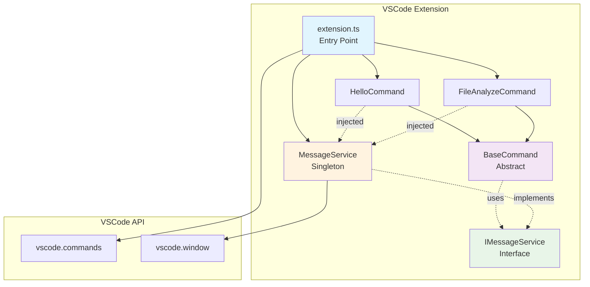
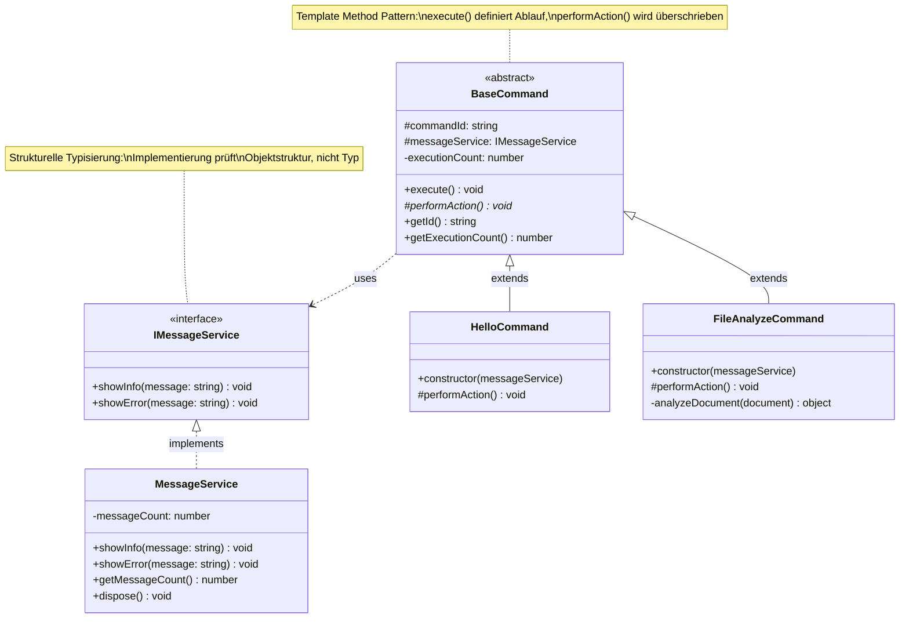
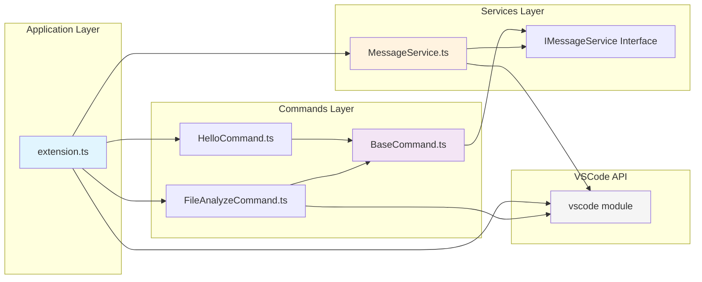

# OOP Grundlagen für VSCode Extensions

## 🎯 Lernziele

Diese Extension demonstriert **4 zentrale OOP-Konzepte** für VSCode Extensions:

1. **Interface-basierte Services** (strukturelle Typisierung)
2. **Abstrakte Basisklassen** (Template Method Pattern)  
3. **Dependency Injection** (manuell, einfach)
4. **Dispose-Pattern** (Ressourcen-Management)

## 📊 Architektur-Überblick



## 📁 Einfache Struktur

```
src/
├── extension.ts                    # Entry Point mit DI
├── services/
│   └── MessageService.ts          # Interface + Implementierung
└── commands/
    ├── BaseCommand.ts              # Abstrakte Basisklasse
    ├── HelloCommand.ts             # Einfacher Command
    └── FileAnalyzeCommand.ts       # Command mit Business Logic
```

## 🏗️ Klassendiagramm



## 🔄 Sequenzdiagramm: Command-Ausführung


## 🔗 Modul-Dependencies



## 🔧 Setup

```bash
# Ordner erstellen
mkdir -p src/services src/commands

# Code aus Artifact kopieren
# Files: MessageService.ts, BaseCommand.ts, HelloCommand.ts, FileAnalyzeCommand.ts, extension.ts

# Kompilieren und starten
yarn compile && F5
```

## 🎮 Commands testen

- `Demo: Hello OOP` - Einfacher Command mit Service
- `Demo: Analyze File` - Editor-Analyse  
- `Demo: Show Status` - Ausführungsstatistiken

## 🔍 OOP-Konzepte im Detail

### 1. Interface-basierte Services

```typescript
// Interface definiert Contract
interface IMessageService {
    showInfo(message: string): void;
    showError(message: string): void;
}

// Klasse implementiert Interface (strukturell!)
class MessageService implements IMessageService {
    // Implementation...
}
```

**Java-Unterschied:** TypeScript prüft strukturell, nicht nominal.

### 2. Abstrakte Basisklasse (Template Method)

```typescript
abstract class BaseCommand {
    public execute(): void {
        // Template Method definiert Ablauf
        this.performAction(); // Abstrakte Methode
    }
    
    protected abstract performAction(): void;
}
```

**Bekannt aus Java:** Gleiche Syntax, gleiche Semantik.

### 3. Dependency Injection (manuell)

```typescript
// Service wird in Constructor injiziert
class HelloCommand extends BaseCommand {
    constructor(messageService: IMessageService) {
        super('demo.hello', messageService);
    }
}

// In extension.ts: Services manuell erstellen und injizieren
const messageService = new MessageService();
const command = new HelloCommand(messageService);
```

**Vereinfacht:** Kein Framework wie Spring, aber gleiches Prinzip.

### 4. Dispose-Pattern

```typescript
class MessageService {
    public dispose(): void {
        // Cleanup-Logik
    }
}

// In extension.ts: Automatic cleanup
context.subscriptions.push({
    dispose: () => messageService.dispose()
});
```

**VSCode-spezifisch:** Automatisches Cleanup beim Deaktivieren.

## 📊 Vergleich: Funktional vs. OOP

| Aspekt | Funktional | OOP |
|--------|------------|-----|
| Commands | Einzelfunktionen | Klassen-Hierarchie |
| Shared Logic | Code-Duplikation | BaseCommand-Vererbung |  
| Services | Direkte API-Calls | Injizierte Dependencies |
| Testing | Schwer mockbar | Interface-Mocking |

## 🚀 Nächste Schritte

1. **Neuen Command hinzufügen:**
   - Klasse von `BaseCommand` ableiten
   - Service per Constructor injizieren
   - In `extension.ts` registrieren

2. **Neuen Service erstellen:**
   - Interface definieren
   - Klasse implementieren  
   - In Commands injizieren
