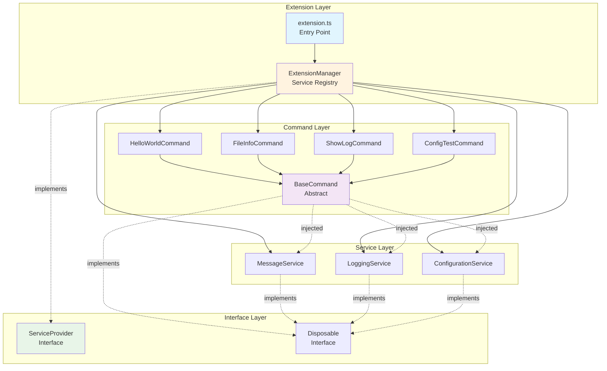
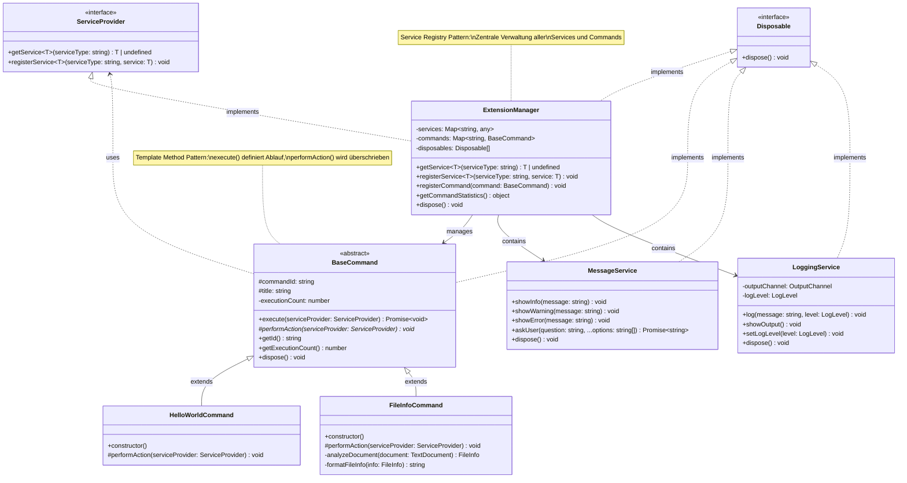
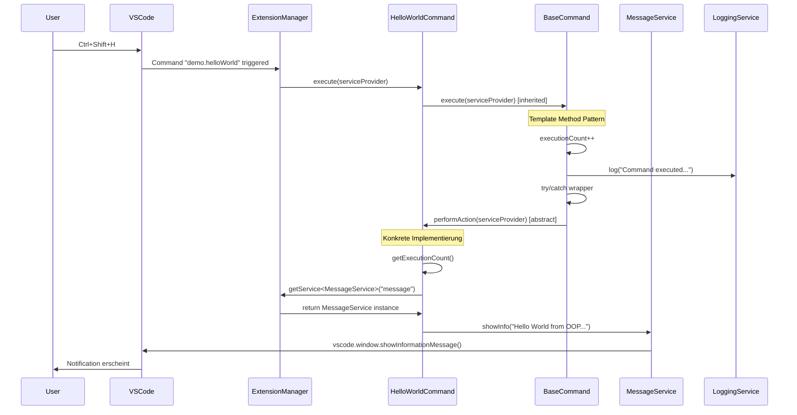

# OOP Grundlagen für VSCode Extensions

## 🎯 Lernziele

Diese Extension demonstriert **objektorientierte Architektur** für VSCode Extensions mit TypeScript und zeigt die Umsetzung bewährter Entwurfsmuster:

1. **Service-orientierte Architektur** mit Dependency Injection
2. **Template Method Pattern** für einheitliche Command-Ausführung
3. **Service Registry Pattern** für zentrale Service-Verwaltung
4. **Dispose Pattern** für automatisches Ressourcen-Management

---

## 📊 Architektur-Überblick


```mermaid
graph TB
    subgraph "Extension Layer"
        EXT[extension.ts<br/>Entry Point] --> EM[ExtensionManager<br/>Service Registry]
    end
    
    subgraph "Command Layer"
        EM --> HC[HelloWorldCommand]
        EM --> FIC[FileInfoCommand]
        EM --> SLC[ShowLogCommand]
        EM --> CTC[ConfigTestCommand]
        
        HC --> BC[BaseCommand<br/>Abstract]
        FIC --> BC
        SLC --> BC
        CTC --> BC
    end
    
    subgraph "Service Layer"
        EM --> MS[MessageService]
        EM --> LS[LoggingService]
        EM --> CS[ConfigurationService]
        
        BC -.->|injected| MS
        BC -.->|injected| LS
        BC -.->|injected| CS
    end
    
    subgraph "Interface Layer"
        SP[ServiceProvider<br/>Interface]
        DISP[Disposable<br/>Interface]
        
        EM -.->|implements| SP
        BC -.->|implements| DISP
        MS -.->|implements| DISP
        LS -.->|implements| DISP
        CS -.->|implements| DISP
    end
    
    style EXT fill:#e1f5fe
    style BC fill:#f3e5f5
    style SP fill:#e8f5e8
    style EM fill:#fff3e0
```

---

## 📁 Projektstruktur

```
src/
├── extension.ts                    # Extension Entry Point
├── ExtensionManager.ts             # Service Registry & DI Container
├── interfaces/
│   ├── ServiceProvider.ts          # DI Interface
│   └── Disposable.ts               # Resource Management Interface
├── services/
│   ├── MessageService.ts           # User Interaction Service
│   ├── LoggingService.ts           # Logging mit Output Channel
│   └── ConfigurationService.ts     # Typisierte Configuration
└── commands/
    ├── BaseCommand.ts              # Template Method Pattern
    ├── HelloWorldCommand.ts        # Einfacher Demo-Command
    ├── FileInfoCommand.ts          # Document-Analyse Command
    ├── ShowLogCommand.ts           # Log-Anzeige Command
    └── ConfigTestCommand.ts        # Configuration-Demo Command
```

---

## 🎮 Commands & Tastenkürzel

| Command | Tastenkürzel | Beschreibung |
|---------|-------------|--------------|
| **Demo: Hello World** | `Ctrl+Shift+H` | Einfacher Command mit Service-Injection |
| **Demo: Show File Information** | `Ctrl+Shift+I` | Analysiert aktive Datei (Editor erforderlich) |
| **Demo: Show Extension Log** | `Ctrl+Shift+L` | Öffnet Extension-Log im Output-Panel |
| **Demo: Test Configuration** | `Ctrl+Shift+C` | Interaktive Konfigurationsänderung |

> **macOS:** `Cmd` statt `Ctrl` verwenden

**Alternative Nutzung:**
- Command Palette: `Ctrl+Shift+P` → "Demo: ..."
- Alle Commands sind auch über die Command Palette verfügbar

---

## 🏗️ Klassendiagramm


```mermaid
classDiagram
    class ServiceProvider {
        <<interface>>
        +getService~T~(serviceType: string) T | undefined
        +registerService~T~(serviceType: string, service: T) void
    }
    
    class Disposable {
        <<interface>>
        +dispose() void
    }
    
    class ExtensionManager {
        -services: Map~string, any~
        -commands: Map~string, BaseCommand~
        -disposables: Disposable[]
        +getService~T~(serviceType: string) T | undefined
        +registerService~T~(serviceType: string, service: T) void
        +registerCommand(command: BaseCommand) void
        +getCommandStatistics() object
        +dispose() void
    }
    
    class BaseCommand {
        <<abstract>>
        #commandId: string
        #title: string
        -executionCount: number
        +execute(serviceProvider: ServiceProvider) Promise~void~
        #performAction(serviceProvider: ServiceProvider) void*
        +getId() string
        +getExecutionCount() number
        +dispose() void
    }
    
    class MessageService {
        +showInfo(message: string) void
        +showWarning(message: string) void
        +showError(message: string) void
        +askUser(question: string, ...options: string[]) Promise~string~
        +dispose() void
    }
    
    class LoggingService {
        -outputChannel: OutputChannel
        -logLevel: LogLevel
        +log(message: string, level: LogLevel) void
        +showOutput() void
        +setLogLevel(level: LogLevel) void
        +dispose() void
    }
    
    class HelloWorldCommand {
        +constructor()
        #performAction(serviceProvider: ServiceProvider) void
    }
    
    class FileInfoCommand {
        +constructor()
        #performAction(serviceProvider: ServiceProvider) void
        -analyzeDocument(document: TextDocument) FileInfo
        -formatFileInfo(info: FileInfo) string
    }
    
    ServiceProvider <|.. ExtensionManager : implements
    Disposable <|.. ExtensionManager : implements
    Disposable <|.. BaseCommand : implements
    Disposable <|.. MessageService : implements
    Disposable <|.. LoggingService : implements
    
    BaseCommand <|-- HelloWorldCommand : extends
    BaseCommand <|-- FileInfoCommand : extends
    
    ExtensionManager --> BaseCommand : manages
    ExtensionManager --> MessageService : contains
    ExtensionManager --> LoggingService : contains
    
    BaseCommand ..> ServiceProvider : uses
    
    note for BaseCommand "Template Method Pattern:\nexecute() definiert Ablauf,\nperformAction() wird überschrieben"
    note for ExtensionManager "Service Registry Pattern:\nZentrale Verwaltung aller\nServices und Commands"
```

---

## 🔄 Sequenzdiagramm: Command-Ausführung


```mermaid
sequenceDiagram
    participant User
    participant VSCode
    participant ExtMgr as ExtensionManager
    participant Cmd as HelloWorldCommand
    participant Base as BaseCommand
    participant MsgSvc as MessageService
    participant LogSvc as LoggingService
    
    User->>VSCode: Ctrl+Shift+H
    VSCode->>ExtMgr: Command "demo.helloWorld" triggered
    ExtMgr->>Cmd: execute(serviceProvider)
    Cmd->>Base: execute(serviceProvider) [inherited]
    
    Note over Base: Template Method Pattern
    Base->>Base: executionCount++
    Base->>LogSvc: log("Command executed...")
    Base->>Base: try/catch wrapper
    Base->>Cmd: performAction(serviceProvider) [abstract]
    
    Note over Cmd: Konkrete Implementierung
    Cmd->>Cmd: getExecutionCount()
    Cmd->>ExtMgr: getService<MessageService>("message")
    ExtMgr->>Cmd: return MessageService instance
    Cmd->>MsgSvc: showInfo("Hello World from OOP...")
    MsgSvc->>VSCode: vscode.window.showInformationMessage()
    VSCode->>User: Notification erscheint
```

---

## 🔧 Setup & Installation

### Voraussetzungen
- **Node.js** (16+) und **Yarn**
- **VSCode** mit Extension Development Support
- **TypeScript** Grundkenntnisse

### Installation
```bash
# 1. Projekt initialisieren
mkdir vscode-oop-demo && cd vscode-oop-demo
yarn init -y

# 2. Dependencies installieren
yarn add -D @types/vscode @types/node @types/mocha
yarn add -D typescript @typescript-eslint/eslint-plugin @typescript-eslint/parser
yarn add -D eslint @vscode/test-cli @vscode/test-electron

# 3. Projektstruktur erstellen
mkdir -p src/{interfaces,services,commands}
mkdir -p .vscode

# 4. Code-Dateien erstellen (siehe Artifacts)
# - package.json (komplette Konfiguration)
# - tsconfig.json 
# - extension.ts + alle anderen TypeScript-Dateien

# 5. Kompilieren und testen
yarn compile
```

### Development-Workflow
```bash
# Watch-Modus für automatische Kompilierung
yarn watch

# Extension testen (öffnet neues VSCode-Fenster)
F5 (in VSCode)

# Oder manuell:
code --extensionDevelopmentPath=.
```

---

## 🔍 OOP-Konzepte im Detail

### 1. Service Registry Pattern (Dependency Injection)

```typescript
// ExtensionManager als DI-Container
export class ExtensionManager implements ServiceProvider {
    private services: Map<string, any> = new Map();
    
    // Service registrieren
    public registerService<T>(serviceType: string, service: T): void {
        this.services.set(serviceType, service);
    }
    
    // Service abrufen (Dependency Injection)
    public getService<T>(serviceType: string): T | undefined {
        return this.services.get(serviceType);
    }
}

// Verwendung in Commands
const messageService = serviceProvider.getService<MessageService>('message');
messageService?.showInfo('Hello World!');
```

**Vorteile:**
- Entkopplung von Services und Consumers
- Testbarkeit durch Service-Mocking
- Zentrale Service-Verwaltung

### 2. Template Method Pattern

```typescript
// BaseCommand definiert einheitlichen Ablauf
export abstract class BaseCommand {
    public async execute(serviceProvider: ServiceProvider): Promise<void> {
        this.executionCount++;                    // 1. Zähler erhöhen
        this.logExecution(serviceProvider);      // 2. Logging
        
        try {
            await this.performAction(serviceProvider); // 3. Konkrete Aktion
        } catch (error) {
            this.handleError(error, serviceProvider);   // 4. Error Handling
        }
    }
    
    // Abstrakte Methode - von Subklassen implementiert
    protected abstract performAction(serviceProvider: ServiceProvider): Promise<void> | void;
}
```

**Vorteile:**
- Einheitlicher Command-Lifecycle
- Automatisches Error Handling und Logging
- Code-Wiederverwendung

### 3. Interface-basierte Services

```typescript
// Interface definiert Contract
export interface ServiceProvider {
    getService<T>(serviceType: string): T | undefined;
    registerService<T>(serviceType: string, service: T): void;
}

// Strukturelle Typisierung (TypeScript-spezifisch)
export interface Disposable extends vscode.Disposable {
    dispose(): void;
}
```

**TypeScript vs. Java:**
- Strukturelle statt nominale Typisierung
- Duck Typing: "If it walks like a duck..."
- Interfaces können erweitert werden

### 4. Dispose Pattern für Ressourcen-Management

```typescript
export class LoggingService implements Disposable {
    private outputChannel: vscode.OutputChannel;
    
    constructor(channelName: string) {
        this.outputChannel = vscode.window.createOutputChannel(channelName);
    }
    
    public dispose(): void {
        this.outputChannel.dispose(); // VSCode-Ressource freigeben
    }
}

// Automatische Registrierung für Cleanup
context.subscriptions.push(service);
```

**VSCode-spezifisch:**
- Automatisches Cleanup beim Extension-Deaktivieren
- Verhinderung von Memory Leaks
- Ordnungsgemäße Ressourcenfreigabe

---

## ⚙️ Konfiguration

Die Extension unterstützt folgende Settings (via `Ctrl+,` → Extensions → Demo Extension):

| Setting | Typ | Default | Beschreibung |
|---------|-----|---------|--------------|
| `demo.logLevel` | enum | `"info"` | Log-Level: debug, info, warn, error |
| `demo.autoSave` | boolean | `true` | Automatisches Speichern aktivieren |
| `demo.maxFileSize` | number | `1024` | Max. Dateigröße in KB für Verarbeitung |
| `demo.enableDebugOutput` | boolean | `false` | Debug-Output in Konsole aktivieren |

**Konfiguration zur Laufzeit ändern:**
- `Ctrl+Shift+C` → Interaktive Konfiguration
- Einstellungen werden sofort übernommen
- Log-Level wird automatisch angepasst

---

## 🧪 Testing & Debugging

### Debug-Modus
```bash
# 1. Watch-Modus starten
yarn watch

# 2. Debug-Extension starten
F5 (in VSCode)

# 3. Breakpoints setzen
# - In Commands: performAction() Methoden
# - In Services: Alle öffentlichen Methoden
# - In ExtensionManager: Service-Registrierung
```

### Logging
- **Output-Panel:** `Ctrl+Shift+L` → "Demo Extension"
- **Debug-Console:** `F12` → Console (bei Debug-Extension)
- **Log-Level:** Via `demo.logLevel` Setting oder `Ctrl+Shift+C`

### Tests
```bash
# Unit-Tests ausführen (wenn implementiert)
yarn test

# Extension-Tests
yarn pretest
```

---

## 🚀 Erweiterungsmöglichkeiten

### Neuen Command hinzufügen

1. **Command-Klasse erstellen:**
```typescript
// src/commands/MyNewCommand.ts
export class MyNewCommand extends BaseCommand {
    constructor() {
        super('demo.myNew', 'My New Command');
    }
    
    protected performAction(serviceProvider: ServiceProvider): void {
        const messageService = serviceProvider.getService<MessageService>('message');
        messageService?.showInfo('My new command executed!');
    }
}
```

2. **In package.json registrieren:**
```json
{
  "command": "demo.myNew",
  "title": "My New Command",
  "category": "Demo"
}
```

3. **In extension.ts hinzufügen:**
```typescript
const commands: BaseCommand[] = [
    // ... existing commands
    new MyNewCommand()
];
```

### Neuen Service hinzufügen

1. **Service-Klasse erstellen:**
```typescript
// src/services/FileService.ts
export class FileService implements Disposable {
    public readFile(path: string): string {
        // Implementation
    }
    
    public dispose(): void {
        // Cleanup
    }
}
```

2. **In ExtensionManager registrieren:**
```typescript
this.registerService('file', new FileService());
```

3. **In Commands verwenden:**
```typescript
const fileService = serviceProvider.getService<FileService>('file');
```

---

## 📚 Weiterführende Ressourcen

### VSCode Extension API
- [Extension API Documentation](https://code.visualstudio.com/api)
- [Extension Guidelines](https://code.visualstudio.com/api/ux-guidelines/overview)
- [Publishing Extensions](https://code.visualstudio.com/api/working-with-extensions/publishing-extension)

### TypeScript & OOP
- [TypeScript Handbook](https://www.typescriptlang.org/docs/)
- [Design Patterns in TypeScript](https://refactoring.guru/design-patterns/typescript)
- [Clean Code TypeScript](https://github.com/labs42io/clean-code-typescript)

### Entwicklung & Testing
- [Extension Testing](https://code.visualstudio.com/api/working-with-extensions/testing-extension)
- [Bundling Extensions](https://code.visualstudio.com/api/working-with-extensions/bundling-extension)
- [Continuous Integration](https://code.visualstudio.com/api/working-with-extensions/continuous-integration)

---

## 📋 Vergleich: Funktional vs. OOP

| Aspekt | Funktional | OOP (diese Extension) |
|--------|------------|----------------------|
| **Commands** | Einzelfunktionen | Klassen-Hierarchie mit BaseCommand |
| **Services** | Direkte vscode API-Calls | Injizierte Service-Dependencies |
| **Shared Logic** | Code-Duplikation | Template Method Pattern |
| **Error Handling** | In jeder Funktion | Zentral in BaseCommand |
| **Logging** | Manual, inkonsistent | Automatisch, strukturiert |
| **Testing** | Schwer mockbar | Interface-basierte Mocks |
| **Maintenance** | Scattered Code | Zentrale Service-Registry |
| **Configuration** | Direkte API-Calls | Typisierter ConfigurationService |
